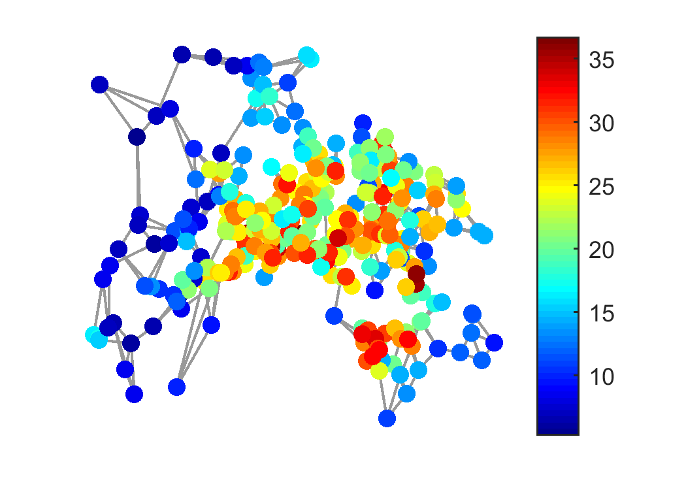
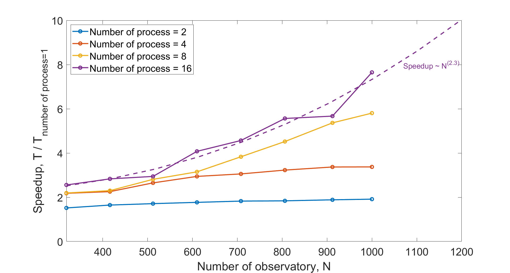
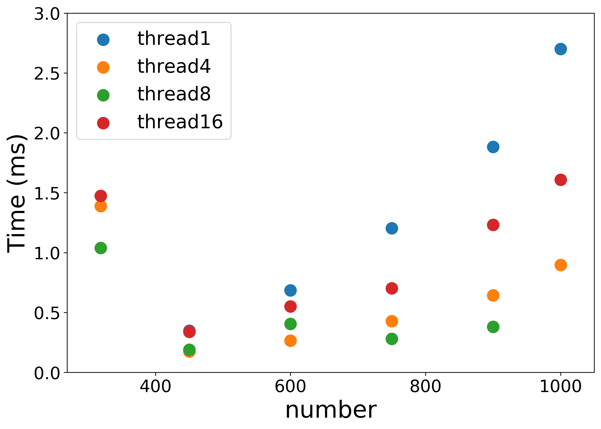
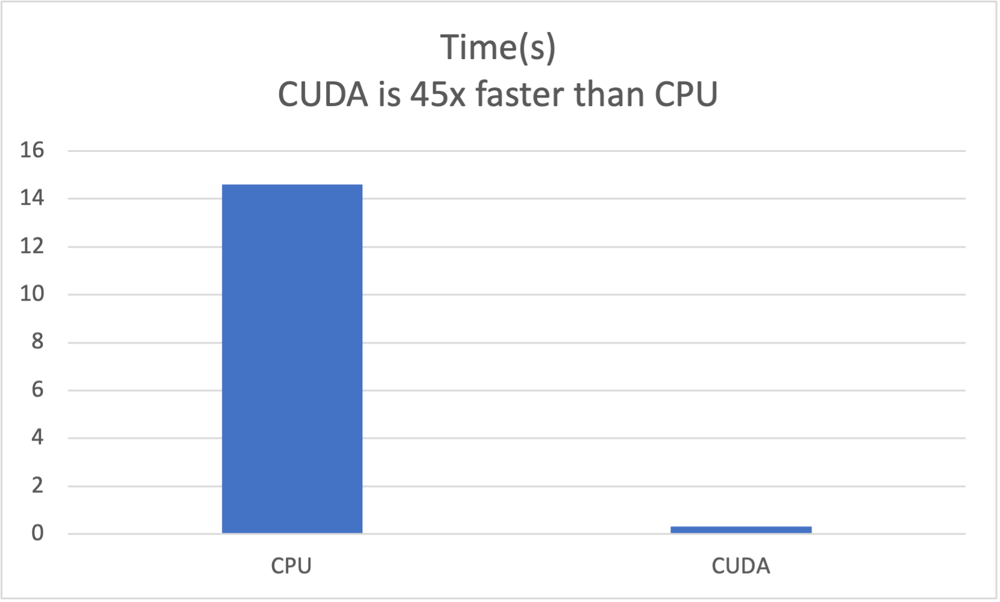

# CSCI-596
Predict temperature using the techniques of graph signal processing. We use the data from 319 observatory to do graph signal processing. And hide some data to predict the temperature for those hidding data.

Use the MPI to speed up the calculations for large data size. When number of observatory is large, there is speedup when we use MPI with more number of process.

Use the OpenMP to speed up the calculations for large data size. The speedup is not significant, since there is communicaton time between threads.

Use the GPU to speed up the calculations. The GPU shows significant speedup.

